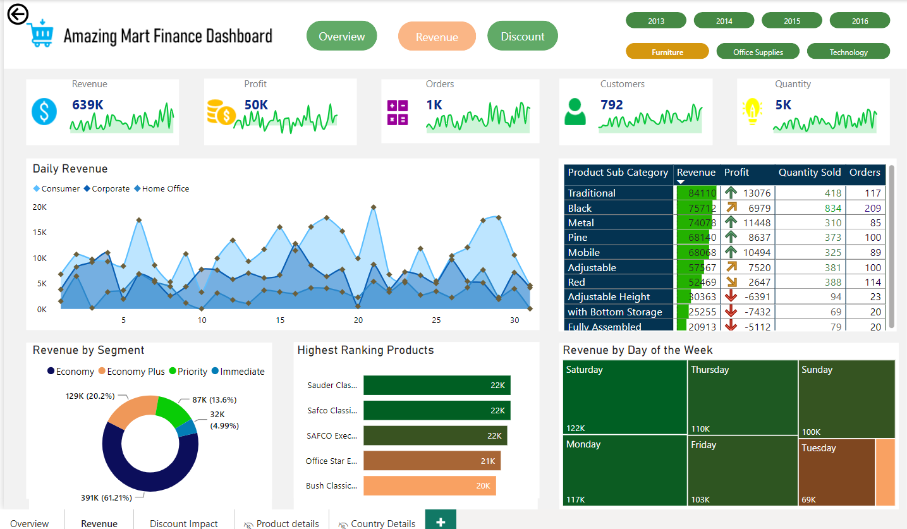

# Amazing-Mart-Data-analysis-using-Power-BI
 
 
 - Picture [Source](https://th.bing.com/th?id=OIP.KJR7866fPDGUmo-Bc_pgtQHaHa&w=250&h=250&c=8&rs=1&qlt=90&o=6&pid=3.1&rm=2***)
  
## Introduction
- In this project, I dive into the fascinating world of data analysis, leveraging the powerful capabilities of Power BI to uncover valuable insights from the vast amounts of data generated by Amazing Mart. Through this project, I aim to provide a comprehensive analysis of various aspects of the business, including sales performance, product trends, and more. By harnessing the rich visualizations and interactive features of Power BI, the main aim is to **bring the data to life**, enabling you to explore and understand the story it tells. Join me on this data-driven journey as I delve into the Amazing Mart dataset, uncover hidden patterns, identify key trends, and make data-driven decisions that drive the success of this remarkable retail enterprise.
---
- **So, fasten your seatbelts and get ready to embark on an exciting adventure of data exploration and analysis with Amazing Mart dataset and Power BI!**

> [!NOTE] ⚠️- _All datasets and reports do not represent any real trading company or organization but just a dummy dataset to demonstrate my strengths and capacity with Microsoft Power BI._

- To interact with the dashboard [Click Here](https://app.powerbi.com/groups/me/reports/c006754c-8114-4c00-8f62-b8cbb74292a5/ReportSection?experience=power-bi)
---
##### Table of Contents  
[Objectives](objectives)  
[Skills and concepts Demostrateds](#Skills and concepts Demostrated)  
...snip...    
<a name="headers"/>

***
## Objectives:
     -  Analyze the sales data of Amazing Mart to identify trends, patterns, and factors influencing revenue and profitability.
     -  Evaluate the performance of different product categories or individual products within Amazing Mart.
     -  Identify top-selling products, analyze their contribution to revenue and profit, and assess their growth potential
     -  Analyze customer preferences for different shipping modes and their impact on customer satisfaction.
     -  Analyze the profitability of products across different categories and sub-categories.
     -  Assess the impact of discounts on sales and profitability.
     -  Determine the distribution of orders across different cities, countries, and regions.
### Questions to answer
      - What is the Annual revenue and profit being generated by Amazing Mart?
      - Whats is the top perfoming products by Revenue. Profit, quantity and number of orders?
      - Top customers with highest number of repeated orders?

 ***

#### Skills and concepts Demostrated
 - Data cleaning( *using Power Query*)
 - Calculated Columns
 - Data Analysis Expression (*DAX*) Functions
 - Dashboard design
 - Data Visualisation
 - Data Modelling (*Star schema*)
 - Data Drill through(*for Product, Discount and Countries detailed view*)

### Data source
- Data downloaded [here](https://github.com/pavanjuturu/Tableau/blob/master/AmazingMartEU2.xlsx)
- Although it might look a bit different as i  made some alterations here and there to meet my objectives and goals
  ##### Contents of the data:
  - 2 workbooks related with primary keys and foreign keys.
  - The workbooks contained information about customers orders around the globe, product categories, Discounts offered per sale, shipping details, just to mention a few.
 
 ---
 ### Data transformation
 - Removed missing values which did not affect my analysis since they were only 7 missing values in a dataset with 8051 rows
 - Created calculated columns and  measures
    -  Discount Revenue:
         -  <pre><code id="sqlQuery">CODE:✍️ Discount Revenue = OrderBreakdown[Discount] * OrderBreakdown[Sales] </code></pre><button class="btn" data-clipboard-target="#sqlQuery">
          
    - Selling Price :
         -  <pre><code id="sqlQuery">CODE:✍️ Selling Price = OrderBreakdown[Sales]/OrderBreakdown[Quantity] </code></pre><button class="btn" data-clipboard-target="#sqlQuery">

   - #####  Number of days for shipment delivery:
      -  <pre><code id="sqlQuery">CODE:✍️ Days to Ship Product = DATEDIFF(ListOfOrders[Order Date],ListOfOrders[Ship Date],DAY) </code></pre><button class="btn" data-clipboard-target="#sqlQuery">

 ---

### Data analysis and visualisation
- To answer the questions i drafted at the begining of the project, i currated a 6 pages dashboard(*only 3 visible*)
  ### Overview Page

  ### Revenue Page
  

  ### Discount Impact Page
  

  #### Insights and Recommendations
  - Discount Strategy:
         - Despite running at a loss, discounts at 40%, 50%, and 60% generate low revenue, indicating their ineffectiveness in driving sales volume.
         - *Recomendation*: Analyze the profitability of discounted products and assess their contribution to overall revenue, and Optimize discount levels based on product categories or customer segments that respond well to these discounts.

  - Top Income Generating Products:
        -  Bookcases, copiers, and phones are the highest income generating products for Amazing Mart.
        - *Recomendatiosn* : Analyze the factors that contribute to the success of these products, such as customer demand, competitive advantages, or marketing efforts and Allocate resources and marketing efforts to promote and expand these high-performing product categories further.
  - Customer Loyalty:
        - Identify customers with the highest frequency of repeated orders, averaging 32 orders annually.
        - *Recomendation* Analyze their purchasing behavior, preferences, and demographics to understand the factors driving their loyalty and Implement targeted retention strategies, such as personalized offers, loyalty programs, or excellent customer service, to nurture and expand this loyal customer base.
   
  
        

